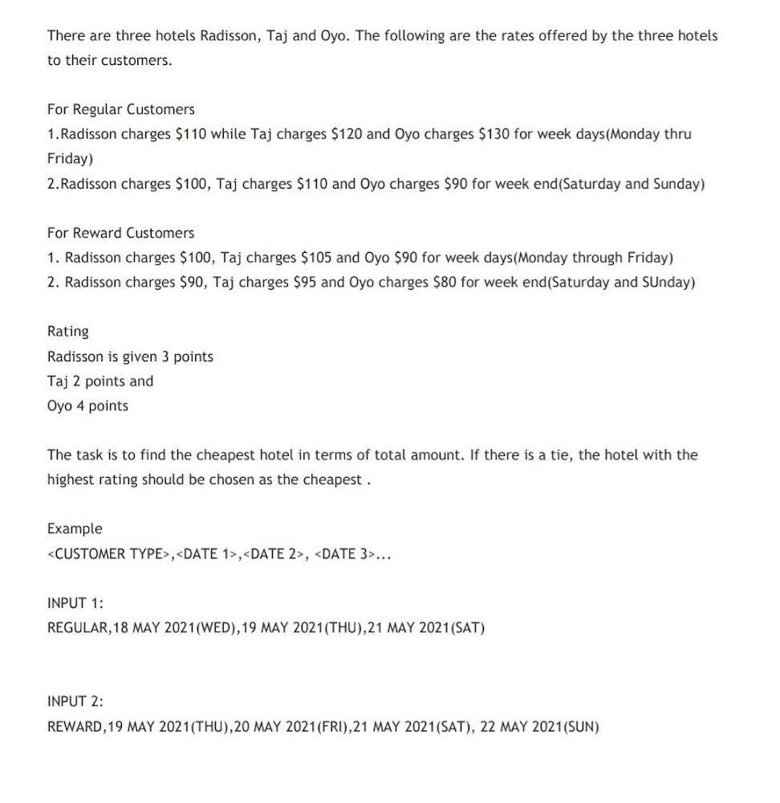
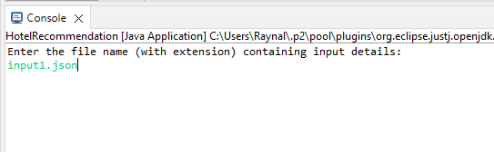
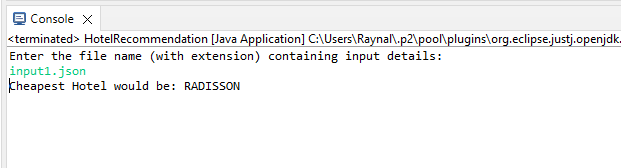

## Interview Question: Hotel Recommendation Program

### Problem Statement:

#### Requirements:
`1>` Create a robust and scalable program using java that satisfies the requirements. 
`2>` Use JSON format for user input. 
`3>` Write a set of tests that demonstrate correctness of the program. 
`4>` Create a readme file summarizing the instructions on exercising the program and on running the tests.

###### Language: Java, Project Package: Maven

#### Running the program:
`1>` Import the program as a Java Project in your IDE. 
`2>` Run as a Java Application. 
`3>` Enter the fileName input 
 
`4>` The cheapest hotel is recommended by the program. 

